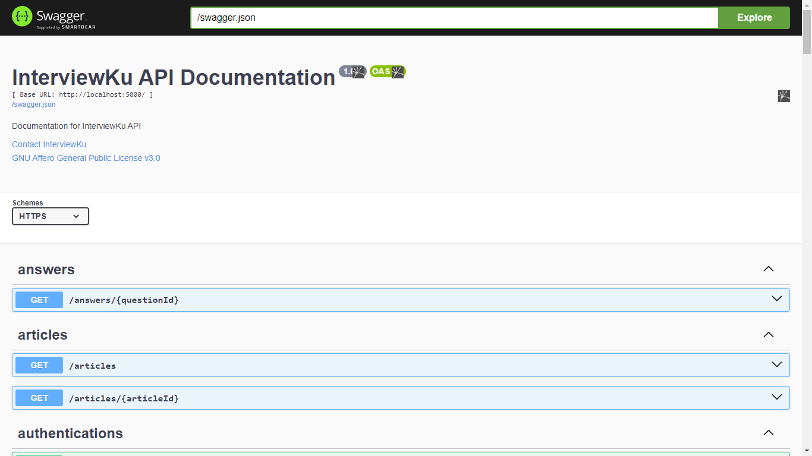
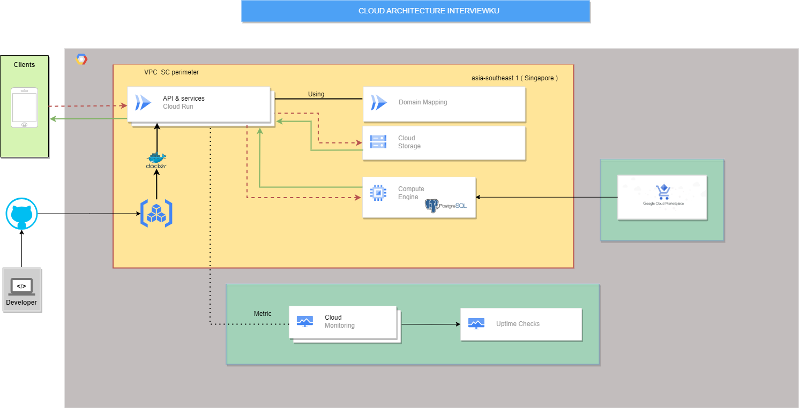

# InterviewKu-backend-API 🚀

This is the API backend for [interviewku app](https://github.com/krisna31/interviewku/tree/master/mobile-development)

## Table of Contents 📋

- [InterviewKu-backend-API 🚀](#interviewku-backend-api-)
  - [Table of Contents 📋](#table-of-contents-)
  - [API Documentation 📖](#api-documentation-)
  - [How to run this project locally 💻](#how-to-run-this-project-locally-)
    - [A. using docker image official (testing only without google service) 🐳](#a-using-docker-image-official-testing-only-without-google-service-)
    - [B. build manually from dockerfile (can be testing or production) 🐳](#b-build-manually-from-dockerfile-can-be-testing-or-production-)
    - [C. from source using npm and nodejs 📦](#c-from-source-using-npm-and-nodejs-)
  - [How to import Postman collection and environment 📥](#how-to-import-postman-collection-and-environment-)
  - [Cloud Architecture ☁️](#cloud-architecture-️)
  - [Tech Stack Used in This **Project** 🛠️](#tech-stack-used-in-this-project-️)
  - [Detailed Dependencies 📚](#detailed-dependencies-)
    - [Development Dependencies](#development-dependencies)
  - [License 📄](#license-)

## API Documentation 📖

For more [detailed API documentation, please visit interviewku-backend or click image below](http://backup.interviewku.tech/documentation)

## How to run this project locally 💻

### A. using docker image official (testing only without google service) 🐳

1. Clone this repository by running `git clone https://github.com/krisna31/interviewku.git` in your terminal
2. Run `cd interviewku/backend` to enter the project directory
3. Run `cp .env.local .env` to copy the environment variables
4. Edit `.env` file to match your environment (e.g. database name, username, password, etc.)
5. Run `docker run -d -p 5000:5000 --env-file .env asia-southeast1-docker.pkg.dev/interviewku/interviewku-registry/interviewku-api:0.0.1` to start the server
6. Open `http://localhost:5000` in your browser or API client (e.g. Postman) to explore the API
7. Open `http://localhost:5000/documentation` in your browser to explore the API documentation (optional)

### B. build manually from dockerfile (can be testing or production) 🐳

1. Clone this repository by running `git clone https://github.com/krisna31/interviewku.git` in your terminal
2. Run `cd interviewku/backend` to enter the project directory
3. Run `cp .env.local .env` to copy the environment variables
4. Edit `.env` file to match your environment (e.g. database name, username, password, etc.)
5. If you set `NODE_ENV=prod & AUDIO_SERVICE=true` in `.env` file then you must have `google-cloud-key.json` file in `interviewku/backend` directory
6. Run `docker build -t interviewku-api:0.0.1 .` to build the docker image
7. Run `docker run -d -p 5000:5000 --env-file .env interviewku-api:0.0.1` to start the server
8. Open `http://localhost:5000` in your browser or API client (e.g. Postman) to explore the API
9. Open `http://localhost:5000/documentation` in your browser to explore the API documentation (optional)

### C. from source using npm and nodejs 📦

1. Clone this repository by running `git clone https://github.com/krisna31/interviewku.git` in your terminal
2. Run `cd interviewku/backend` to enter the project directory
3. Run `cp .env.local .env` to copy the environment variables
4. Edit `.env` file to match your environment (e.g. database name, username, password, etc.)
5. Run `npm install` to install all dependencies
6. Run `npm run migrate up` to run the migration (make sure you have PostgreSQL installed and running)
7. Run `npm run dev` to start the server
8. Open `http://localhost:5000` in your browser or API client (e.g. Postman) to explore the API
9. Open `http://localhost:5000/documentation` in your browser to explore the API documentation (optional)

## How to import Postman collection and environment 📥

1. Open Postman desktop app
2. Click `import` button
3. Click `Choose Folder` button
4. Select `interviewku/backend/Postman` folder
5. Check all collections and environments
6. Click `import` button
7. Click collection `InterviewKu Collection 0.0.1` to explore the API
8. Choose environment `InterviewKu Env 0.0.1` to test the API locally
9. Feel free to explore the API

## Cloud Architecture ☁️

## Tech Stack Used in This **Project** 🛠️

- **[Node.js](https://nodejs.org/en/)** - JavaScript runtime environment.
- **[PostgreSQL](https://www.postgresql.org/)** - Open source relational database.
- **[Docker](https://www.docker.com/)** - Containerization platform.
- **[Google Cloud Platform](https://cloud.google.com/)** - Cloud computing platform.
- **[TensorFlow.js](https://www.tensorflow.org/js)** - Machine learning framework.
- **[Hapi.js](https://hapi.dev/)** - Rich framework for building applications and services.
- **[Swagger](https://swagger.io/)** - API documentation generator.
- **[Postman](https://www.postman.com/)** - API client for testing API endpoints.
- **[ESLint](https://eslint.org/)** - JavaScript linter.

## Detailed Dependencies 📚

- **[@google-cloud/speech](https://www.npmjs.com/package/@google-cloud/speech)** - Google Cloud Speech API for speech-to-text conversion.
- **[@google-cloud/storage](https://www.npmjs.com/package/@google-cloud/storage)** - Google Cloud Storage for scalable and secure object storage.
- **[@hapi/hapi](https://www.npmjs.com/package/@hapi/hapi)** - Hapi.js, a rich framework for building applications and services.
- **[@hapi/inert](https://www.npmjs.com/package/@hapi/inert)** - Hapi inert plugin for serving static files.
- **[@hapi/jwt](https://www.npmjs.com/package/@hapi/jwt)** - Hapi JWT authentication plugin.
- **[@hapi/vision](https://www.npmjs.com/package/@hapi/vision)** - Hapi vision plugin for template rendering.
- **[@tensorflow/tfjs-node](https://www.npmjs.com/package/@tensorflow/tfjs-node)** - TensorFlow.js for Node.js, enabling machine learning.
- **[bcrypt](https://www.npmjs.com/package/bcrypt)** - Library for hashing passwords.
- **[dotenv](https://www.npmjs.com/package/dotenv)** - Loads environment variables from a .env file.
- **[get-audio-duration](https://www.npmjs.com/package/get-audio-duration)** - Retrieves audio file duration.
- **[hapi-rate-limit](https://www.npmjs.com/package/hapi-rate-limit)** - Rate limiting plugin for Hapi.js.
- **[hapi-swagger](https://www.npmjs.com/package/hapi-swagger)** - Swagger documentation generator for Hapi.js APIs.
- **[joi](https://www.npmjs.com/package/joi)** - Data validation library.
- **[joi-password](https://www.npmjs.com/package/joi-password)** - Password complexity validation with Joi.
- **[nanoid](https://www.npmjs.com/package/nanoid)** - Tiny, secure, URL-friendly unique string ID generator.
- **[node-pg-migrate](https://www.npmjs.com/package/node-pg-migrate)** - PostgreSQL schema migration tool.
- **[nodemailer](https://www.npmjs.com/package/nodemailer)** - Send emails with Node.js.
- **[pg](https://www.npmjs.com/package/pg)** - PostgreSQL client for Node.js.

### Development Dependencies

- **[eslint](https://www.npmjs.com/package/eslint)** - JavaScript linter.
- **[eslint-config-airbnb-base](https://www.npmjs.com/package/eslint-config-airbnb-base)** - Airbnb's base ESLint configuration.
- **[eslint-plugin-import](https://www.npmjs.com/package/eslint-plugin-import)** - ESLint plugin for linting import statements.
- **[nodemon](https://www.npmjs.com/package/nodemon)** - Monitor for changes and automatically restart the server.
- **[postman desktop](https://www.postman.com/)** - API client for testing API endpoints.

## License 📄

This project is licensed under the GNU Affero General Public License v3.0 License - see the [LICENSE](../LICENSE) file for details.

---

@2023 All Rights Reserved, Made with ❤️ by [Backend InterviewKu Team](https://github.com/krisna31/interviewku/graphs/contributors) 🤗
